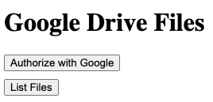
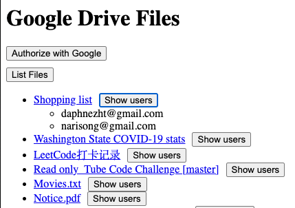

# Google Drive Files Dashboard

Please check a quick video (docs/test.mov) for the result

1. Follow this [link](https://developers.google.com/drive/api/quickstart/js#set_up_your_environment) to enable Google Drive API, create an OAuth Client, and download the credentials. Use `http://localhost:3000/oauth2callback` as the redirect uri
1. Put these values in .env file, client id, client secret, and redirect uri, like this

   ``` bash
   CLIENT_ID=""
   CLIENT_SECRET=""
   REDIRECT_URI=""
   ```

1. Run `npm install`
1. Run `npm run start` which starts a nodemon server to automatically reload changes if you want to update the server code (`app.js`)
1. Go to `localhost:3000` in a browser, and you should see something like below
   
1. Click `Authorize with Google` and finish authentication
1. Click `List Files` and you will see something like below (without the expanded users for now)
   
1. Click any file to download it. Google Drive API requires the file to be exported to some format before downloading, so for this exercise, I exported the files to pdf
1. Click `Show users` of any file, and you will see the list of users like above
1. P.S. I skipped some essentials for this to be in production, like null check, better error handling, etc. We can talk about them if interested.
